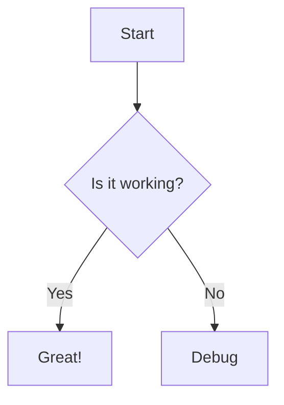
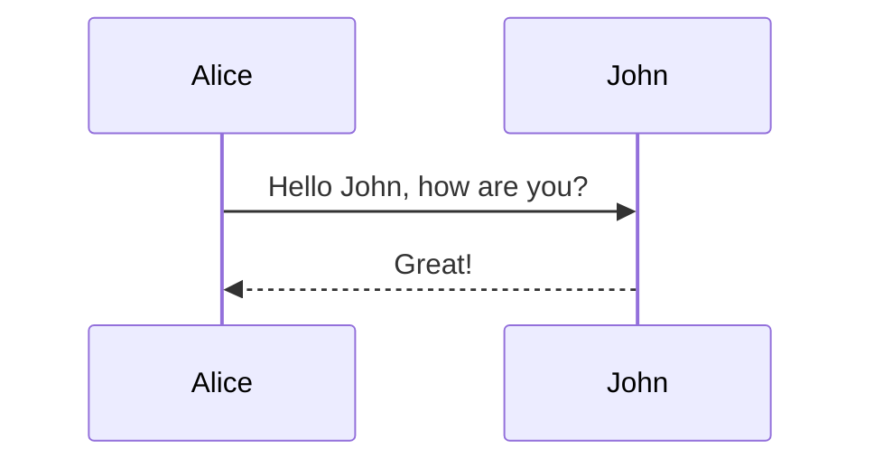
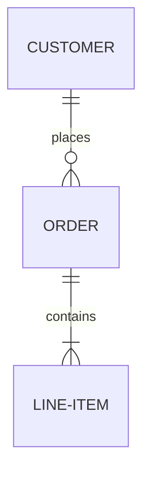
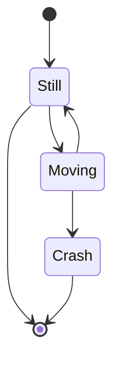

# Diagrams as Code (Mermaid)

Render diagrams dynamically from text.

## Flowchart

## Sequence Diagram

## Entity Relationship (ER)

## State Diagram

## Renderer Compatibility

| Feature              | GitHub | GitLab | VS Code   | Obsidian  | Docusaurus |
|----------------------|:------:|:------:|:---------:|:---------:|:----------:|
| Mermaid (built-in)   | ✓      | ✓      | plugin    | plugin    | plugin     |
| Inline HTML          | limited| limited| ✓         | ✓         | ✓          |

## Common Pitfalls

- **Special characters in labels**: wrap labels in quotes — `A["label (with parens)"]`
- **Long labels**: break with ` ` inside quotes — `A["line one line two"]`
- **Syntax errors fail silently** in some renderers: validate in the Mermaid live editor (`mermaid.live`) first.
- **Never nest** a Mermaid block inside another fenced code block.

