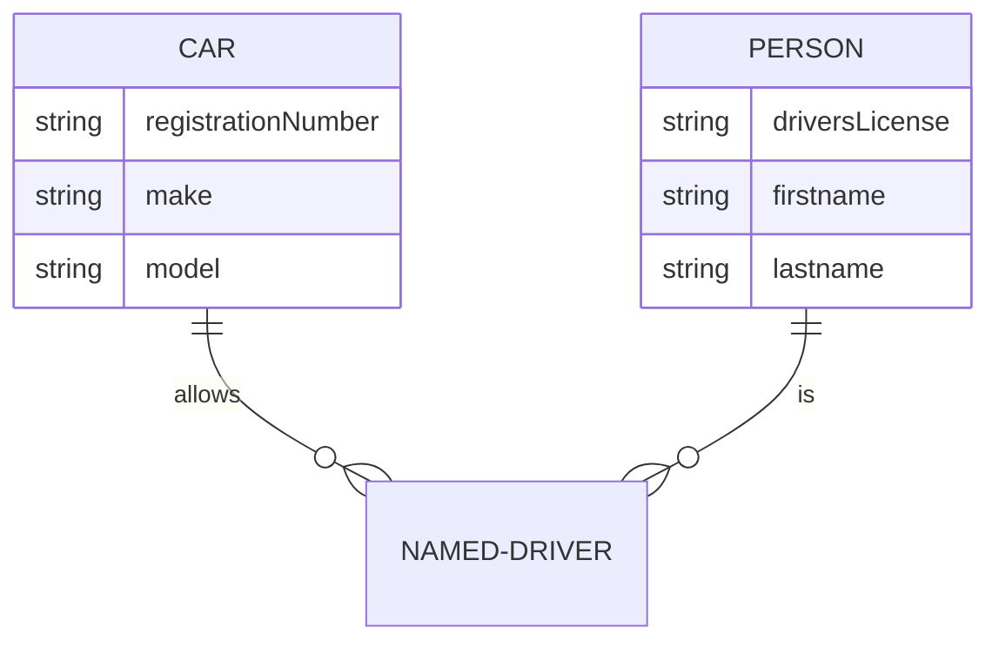
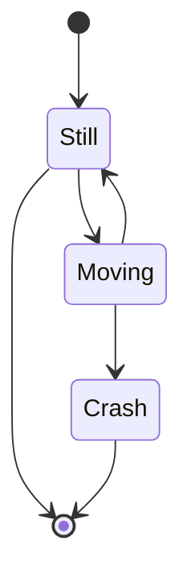
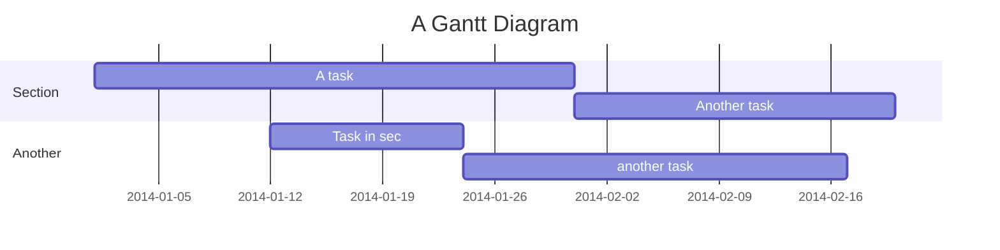
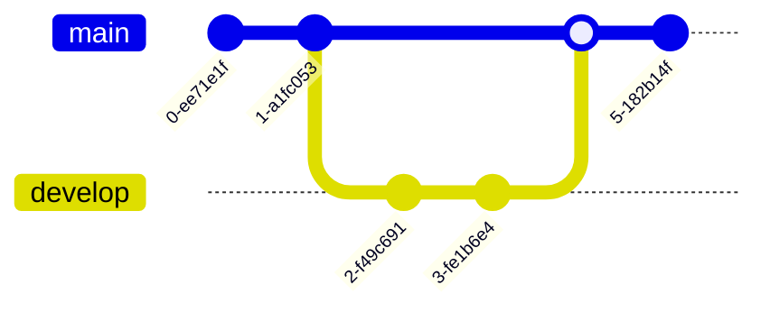
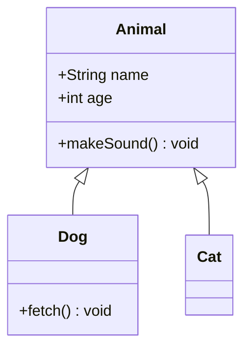
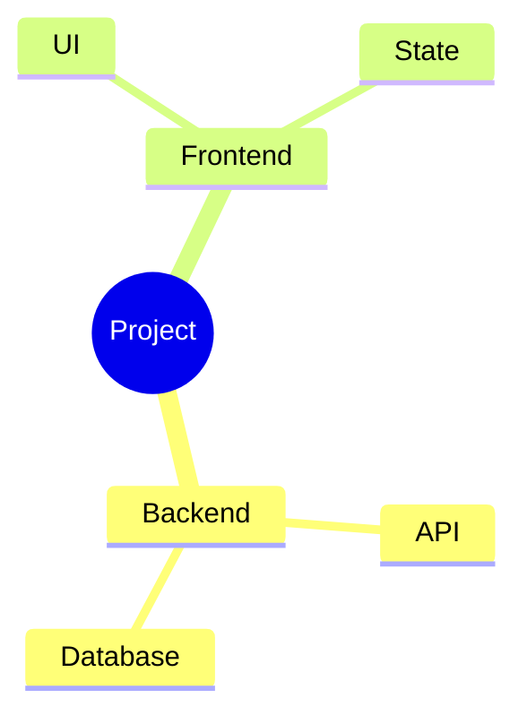
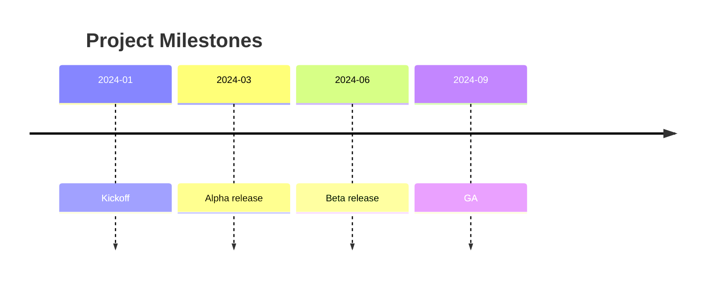
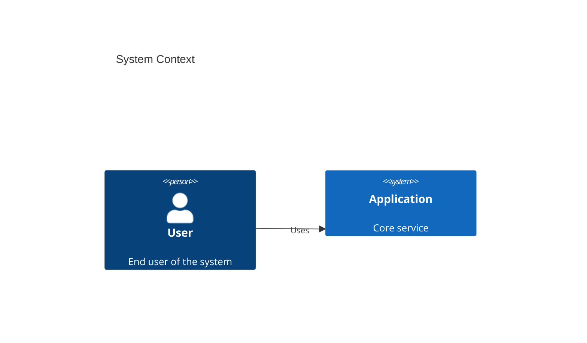

# Advanced Diagram Types

## Entity Relationship (ER)
Used for database schemas.

## State Diagram
State machines and transitions.

## Gantt Chart
Project planning.

## Git Graph
Visualize git history.

## Class Diagram
Object model and inheritance.

## Mindmap
Hierarchical topic breakdown.

## Timeline
Ordered events in time.

## C4 Context Diagram
System context modeling (experimental in v11).

