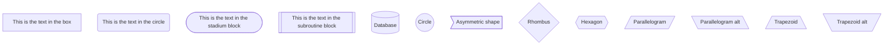
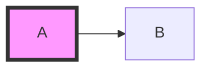
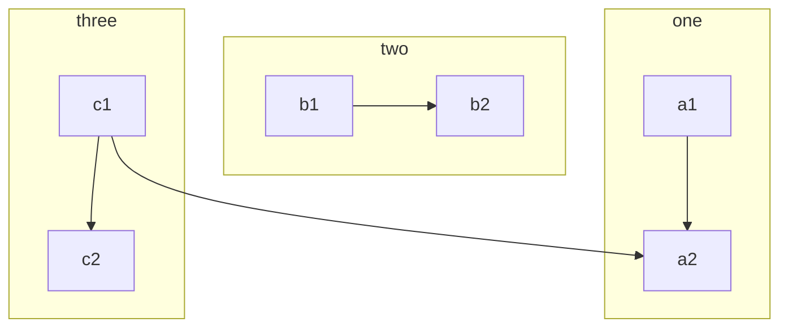
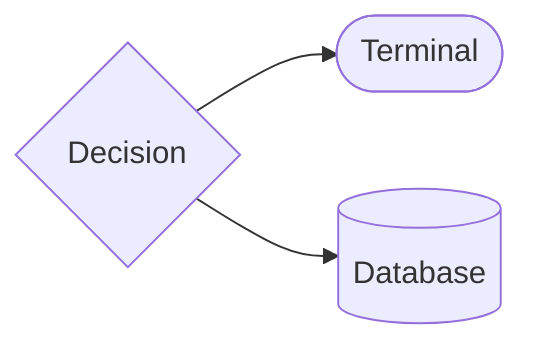

# Flowchart Syntax Guide

## Basic Shapes


## Styling
Apply CSS styles to nodes.



## Subgraphs
Group related nodes.



## v11: Frontmatter Config

Configure layout and appearance per diagram using YAML frontmatter above the diagram keyword.

```
---
config:
  layout: elk
  look: neo
  theme: default
---
flowchart LR
    A --> B --> C
```

`layout: elk` gives deterministic, non-overlapping positioning.
`look: neo` applies the modern default visual style (v11 default).
`theme`: `default`, `forest`, `dark`, `neutral`.

## v11: Extended Shape Syntax

30+ shapes are available via the `@{ shape: ... }` annotation:



Legacy shape syntax (`{Rhombus}`, `[(Database)]`, `[/Parallelogram/]`) still works and is backward-compatible.

