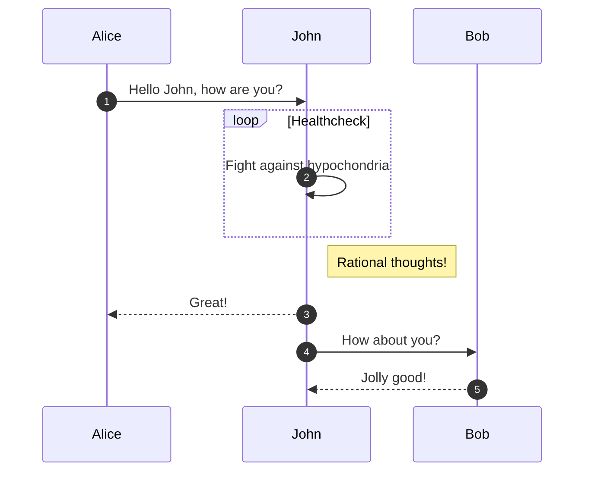
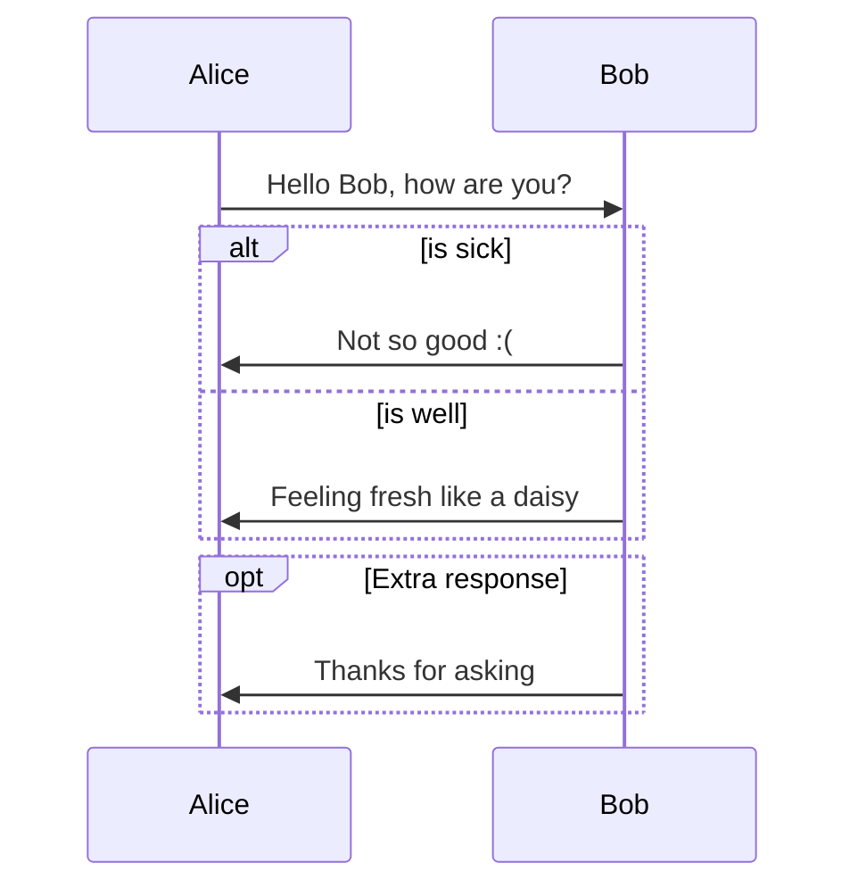
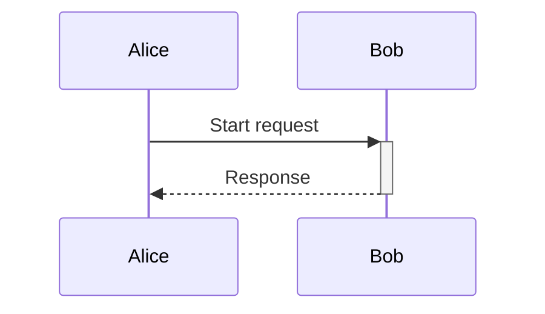

# Sequence Diagram Guide

## Messages & Activations

## Fragments (Alt/Opt/Par)

## Activation Boxes

Show when a participant is active:

`+` activates the participant, `-` deactivates it.

## Common Pitfalls

- Actor names with spaces must be aliased: `participant "My Service" as MS`
- Arrow variants: `->>` (solid), `-->>` (dashed), `->>+` (activate), `<<->>` (bidirectional, v11)
- Keep actors to 5 or fewer per diagram to remain readable.
- `autonumber` adds step numbers to all messages.

