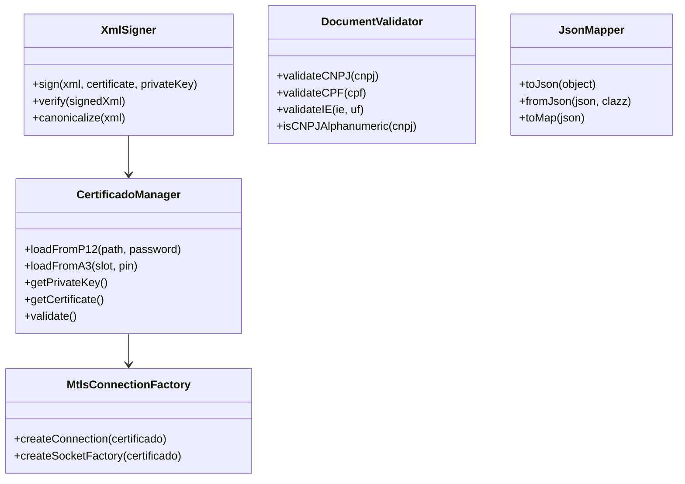

# Plano de Implementação: declaracoes-gov-core

## 1. Visão Geral

### 1.1 Propósito
Biblioteca core agnóstica e reutilizável contendo funcionalidades compartilhadas entre todas as declarações brasileiras (eSocial, EFD-Reinf, DCTFWeb, PGDAS, DEFIS, PER/DCOMP, MIT). Extrai e unifica o carregamento de certificados digitais, assinatura XML, validadores de documentos e utilitários JSON.

### 1.2 Princípios de Design
- **Agnóstica**: Sem dependências de frameworks web ou Bean Validation
- **Thread-Safe**: Todas as classes stateless ou imutáveis
- **Java 8+**: Compatibilidade máxima
- **Zero Dependências Desnecessárias**: Apenas o essencial (Apache XML Security, Jackson opcional)
- **Extensível**: Interfaces claras para implementações customizadas
- **Performance**: Cache de validações, lazy loading de certificados

### 1.3 Versão Inicial
- Versão: 1.0.0
- Java: 8+
- Packaging: JAR

---

## 2. Análise de Requisitos Comuns

### 2.1 Certificados Digitais (mTLS)

#### Requisitos Identificados (eSocial/EFD-Reinf/Serpro)
| Aspecto | Especificação |
|---------|---------------|
| Autoridade | ICP-Brasil credenciada |
| Série | A (assinatura digital) |
| Tipos | A1 (arquivo .p12/.pfx) ou A3 (token/smartcard) |
| Tipos de Certificado | e-CPF (PF), e-CNPJ (PJ) |
| TLS | 1.2 ou superior |
| Uso | Transmissão (mTLS) + Assinatura XML |
| Tamanho Chave | 2048 bits (recomendado) |
| Algoritmo Assinatura | RSA-SHA256 |

#### Requisitos de Validação
- Cadeia de certificação confiável até raiz ICP-Brasil
- Certificado não revogado (CRL/OCSP)
- Certificado não expirado
- Tipo correto (e-CPF/e-CNPJ) conforme operação
- Para PJ: CNPJ base deve corresponder ao contribuinte

### 2.2 Assinatura XML

#### Especificação Técnica (eSocial/EFD-Reinf)
| Elemento | Valor |
|----------|-------|
| Padrão | XML Digital Signature (W3C) |
| Formato | Enveloped |
| Canonicalização | C14N (http://www.w3.org/TR/2001/REC-xml-c14n-20010315) |
| Transformações | Enveloped + C14N |
| Algoritmo Assinatura | RSA-SHA256 (http://www.w3.org/2001/04/xmldsig-more#rsa-sha256) |
| Digest | SHA-256 (http://www.w3.org/2001/04/xmlenc#sha256) |
| Codificação | Base64 |
| Cadeia | EndCertOnly (apenas certificado usuário final) |

#### Transformações Exigidas
```
1. http://www.w3.org/2000/09/xmldsig#enveloped-signature
2. http://www.w3.org/TR/2001/REC-xml-c14n-20010315
```

#### Requisitos de Namespace
- Elemento raiz deve conter apenas namespace da declaração
- Remover xmlns:xsi e xmlns:xsd antes da assinatura
- Usar `setIdAttribute("Id", true)` para referência

### 2.3 Validação de Documentos

#### CNPJ (Atual e Futuro)
| Aspecto | Especificação |
|---------|---------------|
| Formato Atual | 14 dígitos (XX.XXX.XXX/XXXX-XX) |
| Formato Futuro | 14 posições alfanuméricas (jul/2026) |
| Estrutura | 8 raiz + 4 ordem + 2 dígitos verificadores |
| Algoritmo | Módulo 11 |
| Base Cálculo | ASCII - 48 (A=17, B=18, ...) para alfanumérico |
| Pesos DV1 | 5,4,3,2,9,8,7,6,5,4,3,2 |
| Pesos DV2 | 6,5,4,3,2,9,8,7,6,5,4,3,2 |

#### CPF
| Aspecto | Especificação |
|---------|---------------|
| Formato | 11 dígitos (XXX.XXX.XXX-XX) |
| Algoritmo | Módulo 11 |
| Pesos DV1 | 10,9,8,7,6,5,4,3,2 |
| Pesos DV2 | 11,10,9,8,7,6,5,4,3,2 |
| Validações | Não pode todos dígitos iguais |

### 2.4 JSON Utilitários

#### Requisitos
- Parsing/serialization thread-safe
- Suporte a BigDecimal para valores monetários
- Configuração de datas ISO-8601
- Tratamento de nulls configurável
- Validação de schema JSON (opcional)

---

## 3. Arquitetura

### 3.1 Estrutura de Pacotes
```
br.gov.receita.declaracoes.core/
├── certificado/          # Gerenciamento de certificados
│   ├── model/
│   ├── loader/
│   ├── validator/
│   └── mtls/
├── assinatura/           # Assinatura XML
│   ├── model/
│   ├── service/
│   └── util/
├── documento/            # Modelos e validadores de documentos
│   ├── model/
│   ├── validator/
│   └── util/
├── json/                 # Utilitários JSON
│   ├── mapper/
│   └── config/
├── exception/            # Exceções customizadas
├── util/                 # Utilitários gerais
└── constants/            # Constantes
```

### 3.2 Componentes Principais



---

## 4. Especificação de Componentes

### 4.1 Módulo: Certificado (br.gov.receita.declaracoes.core.certificado)

#### Interfaces
```java
public interface CertificadoManager {
    X509Certificate getCertificate();
    PrivateKey getPrivateKey();
    boolean isValid();
    LocalDateTime getValidFrom();
    LocalDateTime getValidTo();
    String getSubjectCN();
    String getIssuerCN();
    TipoCertificado getTipo();
}

public interface CertificadoLoader {
    CertificadoManager loadFromP12(Path path, char[] password) 
        throws CertificadoException;
    CertificadoManager loadFromA3(int slot, String pin) 
        throws CertificadoException;
    CertificadoManager loadFromPem(Path certPath, Path keyPath) 
        throws CertificadoException;
}
```

#### Classes
```java
public enum TipoCertificado {
    E_CPF("e-CPF", "2.16.76.1.3.1"),
    E_CNPJ("e-CNPJ", "2.16.76.1.3.3"),
    E_PJ("e-PJ", "2.16.76.1.3.4"),
    E_PF("e-PF", "2.16.76.1.3.5");
    
    private final String descricao;
    private final String oid;
}

public class CertificadoInfo {
    private final String subjectCN;
    private final String subjectCNPJ;
    private final String subjectCPF;
    private final String issuerCN;
    private final LocalDateTime validFrom;
    private final LocalDateTime validTo;
    private final TipoCertificado tipo;
    private final BigInteger serialNumber;
    private final String thumbprint;
}

public class P12CertificadoManager implements CertificadoManager {
    private final KeyStore keyStore;
    private final String alias;
    private final X509Certificate certificate;
    private final PrivateKey privateKey;
    
    // Thread-safe, immutable após construção
}
```

#### Validadores
```java
public interface CertificadoValidator {
    ValidationResult validate(X509Certificate cert);
    ValidationResult validateChain(X509Certificate[] chain, 
                                   TrustAnchor trustAnchor);
}

public class ICPBrasilValidator implements CertificadoValidator {
    // Valida cadeia ICP-Brasil
    // Verifica revogação via CRL/OCSP
    // Valida período de validade
}
```

#### mTLS
```java
public class MtlsConnectionFactory {
    public SSLContext createSslContext(CertificadoManager certificado);
    public SSLSocketFactory createSocketFactory(CertificadoManager certificado);
    public HostnameVerifier getHostnameVerifier();
}

public class MtlsHttpClientBuilder {
    public HttpClient build(CertificadoManager certificado);
    public HttpClient buildWithProxy(CertificadoManager certificado, 
                                      ProxyConfig proxy);
}
```

### 4.2 Módulo: Assinatura XML (br.gov.receita.declaracoes.core.assinatura)

#### Interfaces
```java
public interface XmlSigner {
    String sign(String xml, SigningConfig config) 
        throws AssinaturaException;
    boolean verify(String signedXml) 
        throws AssinaturaException;
}

public interface Canonicalizer {
    String canonicalize(String xml) throws XMLException;
}
```

#### Classes
```java
public class SigningConfig {
    private final X509Certificate certificate;
    private final PrivateKey privateKey;
    private final String referenceUri;  // #Id ou null
    private final List<String> transforms;
    private final String digestMethod;
    private final String signatureMethod;
    private final boolean includeKeyInfo;
    
    public static class Builder {
        // Builder pattern
    }
}

public class EnvelopedXmlSigner implements XmlSigner {
    private static final String SIGNATURE_METHOD = 
        "http://www.w3.org/2001/04/xmldsig-more#rsa-sha256";
    private static final String DIGEST_METHOD = 
        "http://www.w3.org/2001/04/xmlenc#sha256";
    private static final String C14N_METHOD = 
        "http://www.w3.org/TR/2001/REC-xml-c14n-20010315";
    private static final String ENVELOPED_TRANSFORM = 
        "http://www.w3.org/2000/09/xmldsig#enveloped-signature";
    
    // Implementação thread-safe
    public String sign(String xml, SigningConfig config) {
        // 1. Parse XML
        // 2. Localizar elemento a assinar
        // 3. Aplicar transforms (enveloped + c14n)
        // 4. Calcular digest
        // 5. Criar SignedInfo
        // 6. Assinar com RSA-SHA256
        // 7. Inserir Signature no XML
        // 8. Retornar XML assinado
    }
}

public class AssinaturaInfo {
    private final boolean valid;
    private final X509Certificate signerCertificate;
    private final LocalDateTime signingTime;
    private final String digestValue;
    private final String signatureValue;
    private final List<String> errors;
}
```

#### Utilitários
```java
public class XmlNamespaceCleaner {
    public static String removeXsiXsdAttributes(String xml);
    public static String setIdAttribute(String xml, String elementName, 
                                        String idAttribute);
}

public class XmlFormatter {
    public static String format(String xml);
    public static String minify(String xml);
}
```

### 4.3 Módulo: Documento (br.gov.receita.declaracoes.core.documento)

#### Modelos
```java
public class CNPJ implements Serializable {
    private final String valor;          // Sem formatação
    private final boolean alfanumerico;  // true se versão 2026+
    
    public static CNPJ of(String valor) throws DocumentoException;
    public static CNPJ fromFormatted(String formatado);
    public String format();
    public String getRaiz();            // 8 primeiros
    public String getOrdem();           // 4 do meio
    public String getDigitos();         // 2 últimos
    public boolean isMatriz();          // ordem = 0001
    public boolean isValid();
    
    @Override
    public boolean equals(Object o);
    @Override
    public int hashCode();
    @Override
    public String toString();           // Retorna valor
}

public class CPF implements Serializable {
    private final String valor;
    
    public static CPF of(String valor) throws DocumentoException;
    public static CPF fromFormatted(String formatado);
    public String format();
    public boolean isValid();
    public String getUnformatted();
    
    @Override
    public boolean equals(Object o);
    @Override
    public int hashCode();
    @Override
    public String toString();
}

public class InscricaoEstadual {
    private final String valor;
    private final UF uf;
    
    public static InscricaoEstadual of(String valor, UF uf);
    public boolean isValid();
    public String format();
}
```

#### Validadores
```java
public interface DocumentoValidator<T> {
    boolean isValid(T documento);
    ValidationResult validate(T documento);
}

public class CNPJValidator implements DocumentoValidator<CNPJ> {
    private static final int[] PESOS_DV1 = {5,4,3,2,9,8,7,6,5,4,3,2};
    private static final int[] PESOS_DV2 = {6,5,4,3,2,9,8,7,6,5,4,3,2};
    
    public boolean isValid(CNPJ cnpj) {
        // Suporte a alfanumérico (a partir 2026)
        // Validação módulo 11 com ASCII - 48
    }
}

public class CPFValidator implements DocumentoValidator<CPF> {
    private static final int[] PESOS_DV1 = {10,9,8,7,6,5,4,3,2};
    private static final int[] PESOS_DV2 = {11,10,9,8,7,6,5,4,3,2};
    
    public boolean isValid(CPF cpf) {
        // Validação módulo 11
        // Rejeita todos dígitos iguais
    }
}

public class IEValidator implements DocumentoValidator<InscricaoEstadual> {
    // Implementações específicas por UF
    private static final Map<UF, IEValidatorStrategy> STRATEGIES = Map.of(
        UF.SP, new IESaoPauloValidator(),
        UF.RJ, new IERioJaneiroValidator(),
        // ...
    );
}
```

#### Utilitários
```java
public class DocumentoFormatter {
    public static String formatCNPJ(String cnpj);
    public static String formatCPF(String cpf);
    public static String unformat(String documento);
    public static String mask(String documento, String mask);
}

public class DocumentoCleaner {
    public static String removeNonAlphanumeric(String input);
    public static String keepOnlyNumbers(String input);
}
```

### 4.4 Módulo: JSON (br.gov.receita.declaracoes.core.json)

#### Interfaces
```java
public interface JsonMapper {
    String toJson(Object obj);
    <T> T fromJson(String json, Class<T> clazz);
    <T> T fromJson(String json, Type type);
    Map<String, Object> toMap(String json);
    List<Object> toList(String json);
    JsonNode toTree(String json);
}
```

#### Classes
```java
public class CoreJsonMapper implements JsonMapper {
    private final ObjectMapper objectMapper;
    
    public CoreJsonMapper() {
        this.objectMapper = new ObjectMapper()
            .registerModule(new JavaTimeModule())
            .disable(SerializationFeature.WRITE_DATES_AS_TIMESTAMPS)
            .enable(DeserializationFeature.ACCEPT_SINGLE_VALUE_AS_ARRAY)
            .disable(DeserializationFeature.FAIL_ON_UNKNOWN_PROPERTIES)
            .setSerializationInclusion(JsonInclude.Include.NON_NULL)
            .enable(SerializationFeature.INDENT_OUTPUT);
    }
    
    // Métodos thread-safe - ObjectMapper é thread-safe após configuração
}

public class JsonValidator {
    public boolean isValidJson(String json);
    public boolean validateSchema(String json, String schema);
    public List<String> getValidationErrors(String json, String schema);
}

public class BigDecimalSerializer extends JsonSerializer<BigDecimal> {
    @Override
    public void serialize(BigDecimal value, JsonGenerator gen, 
                          SerializerProvider provider) throws IOException {
        // Garante precisão para valores monetários
        gen.writeNumber(value.setScale(2, RoundingMode.HALF_UP).toPlainString());
    }
}
```

### 4.5 Módulo: Exceções (br.gov.receita.declaracoes.core.exception)

```java
public class DeclaracoesCoreException extends RuntimeException {
    private final String code;
    private final Map<String, Object> details;
}

public class CertificadoException extends DeclaracoesCoreException {
    public static final String CERT_INVALIDO = "CERT_001";
    public static final String CERT_EXPIRADO = "CERT_002";
    public static final String CERT_REVogado = "CERT_003";
    public static final String SENHA_INVALIDA = "CERT_004";
    public static final String TIPO_INVALIDO = "CERT_005";
}

public class AssinaturaException extends DeclaracoesCoreException {
    public static final String XML_INVALIDO = "SIGN_001";
    public static final String ALGORITMO_INVALIDO = "SIGN_002";
    public static final String ASSINATURA_INVALIDA = "SIGN_003";
    public static final String ID_NAO_ENCONTRADO = "SIGN_004";
}

public class DocumentoException extends DeclaracoesCoreException {
    public static final String CNPJ_INVALIDO = "DOC_001";
    public static final String CPF_INVALIDO = "DOC_002";
    public static final String IE_INVALIDA = "DOC_003";
    public static final String FORMATO_INVALIDO = "DOC_004";
}

public class JsonException extends DeclaracoesCoreException {
    public static final String PARSE_ERROR = "JSON_001";
    public static final String SERIALIZATION_ERROR = "JSON_002";
    public static final String SCHEMA_INVALIDO = "JSON_003";
}
```

---

## 5. Dependências

### 5.1 Obrigatórias
```xml
<dependencies>
    <!-- XML Security para assinatura -->
    <dependency>
        <groupId>org.apache.santuario</groupId>
        <artifactId>xmlsec</artifactId>
        <version>3.0.3</version>
    </dependency>
    
    <!-- Logging (facade) -->
    <dependency>
        <groupId>org.slf4j</groupId>
        <artifactId>slf4j-api</artifactId>
        <version>2.0.9</version>
    </dependency>
    
    <!-- Annotations (JSR-305) -->
    <dependency>
        <groupId>com.google.code.findbugs</groupId>
        <artifactId>jsr305</artifactId>
        <version>3.0.2</version>
    </dependency>
</dependencies>
```

### 5.2 Opcionais (provided scope)
```xml
<dependencies>
    <!-- JSON - Jackson (opcional) -->
    <dependency>
        <groupId>com.fasterxml.jackson.core</groupId>
        <artifactId>jackson-databind</artifactId>
        <version>2.16.0</version>
        <scope>provided</scope>
        <optional>true</optional>
    </dependency>
    <dependency>
        <groupId>com.fasterxml.jackson.datatype</groupId>
        <artifactId>jackson-datatype-jsr310</artifactId>
        <version>2.16.0</version>
        <scope>provided</scope>
        <optional>true</optional>
    </dependency>
</dependencies>
```

---

## 6. Roadmap de Implementação

### Fase 1: Fundação (Sprint 1-2)
- [ ] Estrutura Maven e pacotes
- [ ] Constantes e enums (UF, TipoCertificado)
- [ ] Exceções customizadas
- [ ] Utilitários base (strings, datas)

### Fase 2: Documentos (Sprint 3-4)
- [ ] Classe CNPJ com suporte alfanumérico
- [ ] Classe CPF
- [ ] Validador CNPJ (numérico e alfanumérico)
- [ ] Validador CPF
- [ ] Formatter/Utilitários
- [ ] Testes unitários (cobertura >90%)

### Fase 3: Certificados (Sprint 5-6)
- [ ] Modelos de certificado
- [ ] Loader P12
- [ ] Loader A3 (abstração)
- [ ] Validador ICP-Brasil
- [ ] Factory mTLS
- [ ] Testes com certificados reais (A1)

### Fase 4: Assinatura XML (Sprint 7-8)
- [ ] Canonicalizador C14N
- [ ] Assinador Enveloped
- [ ] Validador de assinatura
- [ ] Namespace cleaner
- [ ] Testes com XMLs reais

### Fase 5: JSON (Sprint 9)
- [ ] Wrapper Jackson
- [ ] Serializadores customizados
- [ ] Validação de schema

### Fase 6: Documentação e Release (Sprint 10)
- [ ] Javadoc completo
- [ ] README técnico
- [ ] Exemplos de uso
- [ ] Release 1.0.0

---

## 7. Considerações Técnicas

### 7.1 Thread Safety
- Todas as classes principais devem ser thread-safe
- Preferir immutability
- ObjectMapper do Jackson é thread-safe após configuração
- KeyStore deve ser carregado uma vez e reutilizado

### 7.2 Performance
- Cache de validações de documentos (CNPJ/CPF válidos)
- Lazy loading de certificados
- Canonicalização com pooling de parsers
- Uso de ThreadLocal quando necessário

### 7.3 Segurança
- Senhas como char[] (evitar String imutável)
- Limpar arrays de senha após uso
- Validação de cadeia de certificação
- Verificação de revogação (OCSP preferencial)

### 7.4 Extensibilidade
- Interfaces claras para cada componente
- Uso de Strategy pattern para validadores
- Factory methods para criação de objetos
- SPI para extensões (ServiceLoader)

---

## 8. Testes

### 8.1 Estratégia
- Testes unitários: JUnit 5 + Mockito
- Testes de integração: certificados de teste
- Cobertura mínima: 80% (classes), 70% (linhas)

### 8.2 Casos de Teste Críticos

#### CNPJ
- CNPJs válidos (numéricos)
- CNPJs inválidos
- CNPJs alfanuméricos válidos (preparação 2026)
- Cálculo de dígitos verificadores
- Formatação e unformatting

#### CPF
- CPFs válidos
- CPFs inválidos
- CPFs com dígitos repetidos (devem ser inválidos)

#### Certificados
- Loading P12 válido
- Loading P12 senha incorreta
- Validação de cadeia
- Detecção de expiração

#### Assinatura XML
- Assinatura enveloped válida
- Verificação de assinatura
- Canonicalização C14N
- Transformações corretas

---

## 9. Integração com Outras Libs

### 9.1 Uso no eSocial/EFD-Reinf
```java
// Transmissor usará:
CertificadoManager cert = new P12CertificadoManager("cert.p12", senha);
SslContext sslContext = new MtlsConnectionFactory().createSslContext(cert);

// Assinatura:
XmlSigner signer = new EnvelopedXmlSigner();
String signed = signer.sign(xml, SigningConfig.builder()
    .certificate(cert.getCertificate())
    .privateKey(cert.getPrivateKey())
    .build());
```

### 9.2 Uso no Serpro Transmissor
```java
// Validação antes do envio:
CNPJ cnpj = CNPJ.of("12345678000195");
if (!cnpj.isValid()) {
    throw new DocumentoException("CNPJ inválido");
}

// JSON para APIs REST:
JsonMapper mapper = new CoreJsonMapper();
String json = mapper.toJson(request);
```

---

## 10. Referências

### Legislação e Documentação Oficial
- IN RFB 2.119/2022 - CNPJ
- IN RFB 2.229/2024 - CNPJ Alfanumérico
- Manual eSocial Desenvolvedor
- Manual EFD-Reinf Desenvolvedor
- Especificação XML Digital Signature (W3C)
- ICP-Brasil - DOC-ICP-04

### RFCs e Padrões
- RFC 5280 - X.509 Certificates
- RFC 6960 - OCSP
- W3C XML Signature Syntax and Processing
- W3C Canonical XML

---

*Documento criado em: Abril/2026*
*Versão do Plano: 1.0*
*Responsável: Arquiteto de Software*
