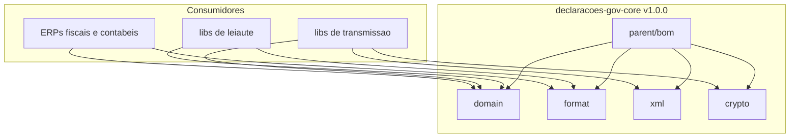

# Arquitetura Complementar - gov-core v1.0.0

Este documento complementa o [02-DESIGN.md](./02-DESIGN.md) com uma visao macro da arquitetura alvo e da transicao entre a linha `v0.1.0` e a linha `v1.0.0`.

## 1. Papel da biblioteca

A `declaracoes-gov-core` e a camada de estabilizacao do ecossistema `declaracoes-*`.

Ela deve isolar dos consumidores:

- documentos e identificadores brasileiros;
- periodos, vigencias e tipos transversais;
- normalizacao, parse e formatacao;
- burocracias tecnicas de XML e certificados digitais.

Ela nao deve absorver:

- clientes HTTP/SOAP/REST;
- OAuth2;
- entrega de eventos;
- regras especificas de leiaute;
- orquestracao de declaracoes.

## 2. Visao macro da arquitetura alvo

## 3. Fronteiras arquiteturais

### 3.1 `domain`
- value objects e tipos do contexto brasileiro;
- contratos de validacao;
- contratos de normalizacao;
- periodos, vigencias e territorio.

### 3.2 `format`
- mascaras e desmascaramento;
- texto fiscal;
- formatos de data, periodo e numero;
- configuracoes reutilizaveis voltadas a integracao governamental.

### 3.3 `xml`
- parsing seguro;
- utilitarios DOM;
- assinatura XML configuravel e agnostica ao leiaute.

### 3.4 `crypto`
- certificados A1/A3;
- PKCS11;
- `SSLContext`;
- diagnosticos operacionais.

## 4. Regra central de confianca

Toda validacao suportada pelo core deve caber em uma destas categorias:

- `oficial`
- `provisoria`
- `estrutural`

Isso nao e apenas uma regra de documentacao. E uma regra arquitetural:

- somente algoritmos oficiais podem sustentar garantias fortes no nucleo;
- algoritmos provisorios exigem tratamento opt-in e aviso explicito;
- suporte estrutural existe para nao bloquear o consumidor quando a regra oficial nao estiver consolidada.

## 5. Estado atual da transicao

- a tag `v0.1.0` existe como baseline preservado;
- a linha de trabalho foi consolidada como `1.0.0`;
- o reactor Maven multi-modulo esta implementado;
- a cascata documental em `docs/` descreve o estado efetivamente entregue;
- a criacao da tag Git final `v1.0.0` depende apenas do fluxo de versionamento do repositorio.
